  

<h3 align="center">Backend com pegada de plataforma</h3>

  Estudante de Ciência da Computação no IFNMG, aberto a oportunidades em desenvolvimento. 
  Trabalho no <b>backend</b> pensando no sistema inteiro: modelo o banco com <b>migrations como fonte única do schema</b>, 
  cuido de <b>CI/CD</b> (GitHub Actions com paridade local), <b>infraestrutura em container</b> e <b>segurança</b> — 
  segredos fora do código, varredura com <code>gitleaks</code> e roles de banco com menor privilégio. 
  Deixei em produção no estágio (Grupo.Con / Doctor.Con, 2026): <b>RPA para emissão de GFD no FGTS Digital</b> e 
  <b>cruzamento de dados relacionais</b> de sistemas do governo. Qualidade sustentada por <b>TDD</b> com testes de integração em banco real.

<!-- Linguagens -->

  
  
  
  
  

<!-- Backend & Dados -->

  
  
  
  

<!-- Plataforma & DevOps -->

  
  
  
  
  

<!-- Qualidade & Segurança -->

  
  
  
  
  

---

### 🚀 Projetos em destaque

- **[Portfólio](https://portfolio.jvapa.com.br/)** · [código](https://github.com/jotavsevla/jotavsevla-portfolio) — Cases bilíngues com a relação explícita entre produto privado, protótipo público e evidência técnica.
- **Água Viva OOP** *(produto atual privado)* · [protótipo público](https://github.com/jotavsevla/aguaVIVA) — O case atual combina backend logístico em Java e solver Python; o repositório público preserva a fundação anterior em Next.js, PostgreSQL, migrations, Docker e testes de integração.
- **auto-fgts** *(privado)* — **Automação (RPA)** para o FGTS Digital: worker **Playwright + BullMQ/Redis**, dashboard **Next.js** e distribuição Windows com **auto-update** via GitHub Releases. Monorepo TypeScript em Docker.
- **[OSA-projects](https://github.com/jotavsevla/OSA-projects)** — Hub acadêmico do registro ao índice: packing fixo/variável, persistência binária, BST, Árvore B e busca com índice invertido. Os READMEs registram também defeitos conhecidos e limites de memória.
- **[CVRP Solver](https://github.com/jotavsevla/tec_heuristica)** — Estudo em C++17 de heurísticas para roteamento capacitado, com benchmarks CMT e auditoria da diferença entre o modelo Physarum pretendido e a seleção executada.
- **[Algoritmos e Estruturas em C](https://github.com/jotavsevla/algoritmos_e_estrutura_de_dados_em_C)** — Listas, TADs, bitmasks, backtracking, pthreads, mochila e tabelas hash, documentados com complexidade e cuidados de alocação.

---

  
  

  

  

  

